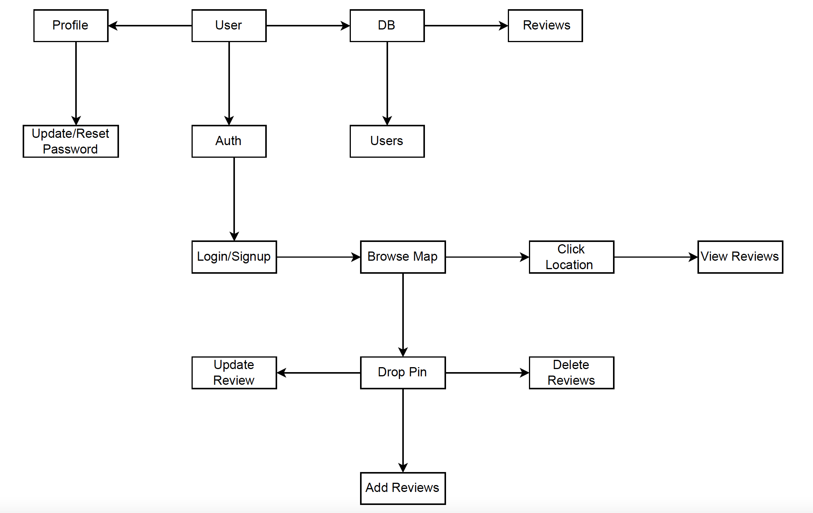

<h1 align="center"> :ramen: Ramenrogu </h1>

## :page_facing_up: Project Description

This web-app is focused on logging all your food hunting activites across the globe. Add pictures, reviews, provide ratings to the restaurants that you've visited, all on a single page.

### :star2: Features

- [ ] React SPA.
- [ ] ExpressJS and MongoDB with NodeJS for the backend.
- [ ] Authentication using JWT.
- [ ] CRUD operations on food reviews.
- [ ] Browse restaurants on the map (Mapbox API).
- [ ] Typescript with ReactJS.
- [ ] Redux Toolkit for state management.
- [ ] Webpack with ESLint, Prettier, Husky with lint-staged.
- [ ] SASS for styling.

### :white_check_mark: User Requirements

- [ ] Create account/sign up.
- [ ] Forgot password link to reset password.
- [ ] Account settings to update username, password,etc.
- [ ] Browse the map to view restaurants at various locations.
- [ ] Check list of reviews and logs of places that the user has visited.
- [ ] Click on a location of a restaurant/place they've visited, have a modal pop-up to have the user fill out a form with the details of the place they've visited, the reviews, comments, images.
- [ ] The user should be able to update or delete the images, review comments that they've provided for a place they've visited.

### :bar_chart: Domain Model

### :busts_in_silhouette: Authors

- [Siddharth Rawat - 2963295](mailto:rawat.sid@northeastern.edu)
- [Jeel Patel - 2928075](mailto:patel.jeel@northeastern.edu)
- [Shubhangi Srivastava - 2197298](mailto:srivastava.sh@northeastern.edu)
- [Unnati Kolhe - 2133343](mailto:kolhe.u@northeastern.edu)
